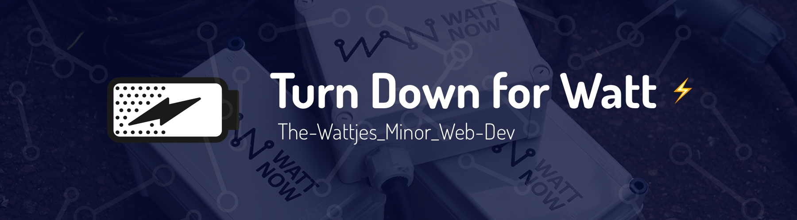

# watt-now



> Real-time Dashboard for festivals

## :book: Introduction
[Turn down for Watt](https://youtu.be/dE-nfzcUiPk?t=14s) *(TDFW)* is an Real-Time application used by Food Trucks on large open festivals.

### Use Case
#### Before the festival
A food truck registers all the appliances it brings to the festival. Based on the number of appliances and the energy each appliance consumes the Food Truck gets a **label** for that particular festival. Each label has a **subscription**. This subscription has a maximum usage of energy consumed during the days of the festival. (For example *2100Kwh*).

*The Food Truck is forced to think about the energy they consume and can consider bringing less appliances to the festival to keep the cost down.*

#### During the festival
During the festival, energy is being measured from the Food Truck. The owner of the Food Truck can see the results in a handy dandy dashboard.

*With this information the owner can determine if appliances need to be removed or turned off more frequently for the next day or next festival.*

#### Inside the Food Truck
Inside the Food Truck the owner can see the current status and energy level. *The owner can determine if the subscription is the right fit and even buy extra subscriptions.*

The employees can also see the current energy usage and see if the energy levels are high or low.

*The employee can then decide if he or she wants to turn off appliances.*

## ⚙️ Installation & Development
These instructions will get you a copy of the project up and running on your local machine for development and testing purposes.

### Prerequisites
#### Software
* Make sure you have [`node`](https://nodejs.org/en/) installed on your machine.
* Install [`mongoDB`](https://docs.mongodb.com/master/tutorial/install-mongodb-on-os-x/) on your machine using homebrew.
* Install Arduino [`IDE`](https://www.arduino.cc/en/Main/Software) on your machine.

To simulate the energy use of a appliance you can use the following hardware.

#### Hardware
* Make sure you have the right hardware requirements
  * NodeMCU microcontroller
  * PotentioMeter

### Installing

#### Node server
Here are the instructions to get the node server up and running.

1. Clone this project to your local machine and change directory/
```
$ git clone https://github.com/dandevri/watt-now.git && cd watt-now
```

1. Install the dependencies and start the server.
```
$ npm start
```

1. You should see the following message in your terminal.
```
Server running 0.0.0.0:3000
```
:tada: It has works!

#### MongoDB
1. To start the MongoDB / Mongoose database
```
mongod
```
2. To populate the database with schemas
```
$ npm run fixtures
```
